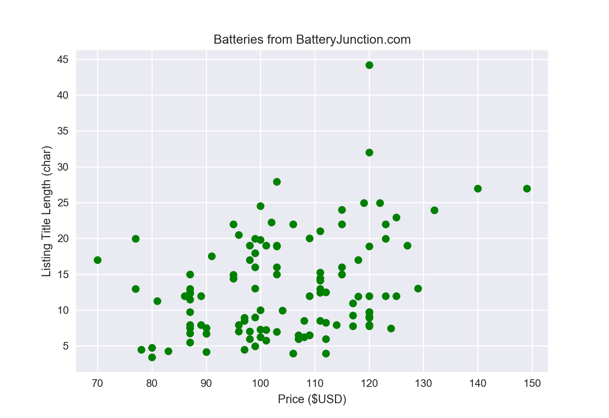

# battery_market
Scrapes &amp; saves prices of batteries.  Just in case someone's interested.

Used to construct the following scatterplot of price vs length of listing title:

Next steps:
- scrape mAh capacity on listing
- scrape 1x/2x/4x info on listing
- construct $ vs mAh scatterplot
- use seaborn to add regressions and CI's to scatterplots

Other Directions:
- add batteryspace.com, plot comparisons
- add ebay, parse by quantity, plot comparisons, add (x sold in last 24 hours) info from ebay
